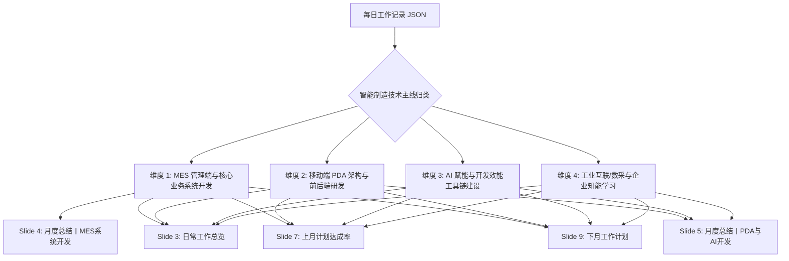

# 📊 MES 工程师月报 PPT 自动化生成与排版规范 (mes-monthly-report)

本技能定义了**智能制造组 / MES 开发工程师月度工作汇报（PPTX）**的端到端标准化流水线。
涵盖从**系统工作记录 JSON 结构化解析**、**工程技术业绩提炼与多维度归类**、**企业级 PPT 模板 OpenXML 无损解包与精准注入**、**SmartArt 图示与状态高亮适配**，到**无头 PowerPoint 图像导出与视觉质检闭环**的全流程标准。

---

## 1. 🎯 汇报定位与核心价值

企业月报是展示软件工程成果、对齐技术方向与向上汇报的关键媒介。传统手工排版耗时且容易出现格式错乱、溢出、字号不一等问题。
本技能实现以下核心目标：
1. **自动化摄入**：直读 MES 系统工作流或 OA 导出的每日工时、任务描述与学习记录 JSON。
2. **专业化提炼**：将零散的流水账日报自动升华提炼为严谨、量化的工业制造软件工程业绩（避免口语化表达）。
3. **像素级无损注入**：基于公司标准模板（如浦林成山企业绿与状态红配色）解包 OpenXML，保持母版、页眉、页脚、Logo、图形阴影 100% 原汁原味。
4. **排版防溢出自适应**：智能计算条目数量、字符长度，自适应调节行高与字号，杜绝换行截断和卡片溢出。
5. **视觉校验闭环**：通过脚本调用 PowerPoint COM 组件自动渲染导出幻灯片高保真 JPG 图片，供 Agent 和工程师进行视觉复核。

---

## 2. 📥 输入数据规范 (Input Schema)

MES 工作流 / OA 系统通常输出如下标准工作记录 JSON 结构：

```json
{
  "total": 0,
  "rows": [
    {
      "id": 18809,
      "name": "裴子含",
      "date": "20260902",
      "group": "智能制造组",
      "jobNumber": "19260984",
      "list": [
        {
          "content": "补充完善相关skill，增加db映射相关规则和查询脚本，更新readme介绍文件。",
          "type": "开发",
          "time": "3",
          "progress": "100",
          "nonCore": "{\"项目名称\":\"MES系统开发\",\"任务描述\":\"补充完善相关skill，增加db映射相关规则和查询脚本...\"}"
        },
        {
          "content": "学习自学习agent hermes相关内容和对应api。",
          "type": "学习",
          "time": "2",
          "progress": "100",
          "nonCore": "{\"学习目标\":\"学习自学习agent hermes相关内容和对应api。\"}"
        }
      ]
    }
  ]
}
```

### 关键字段说明
- `rows[].name`：汇报人姓名（自动映射至 Slide 1 封面）。
- `rows[].group`：所属业务组（如“智能制造组”，映射至 Slide 1 封面）。
- `rows[].date`：工作日期（`YYYYMMDD` 格式，如 `20260902`，用于精准判定与时间范围筛选）。
- `list[].type`：工作属性（`开发` / `日常` / `学习` / `测试`）。
- `list[].content` 与 `nonCore`：工作原始描述、任务目标、接口与项目背景，是提炼核心成果的主要来源。

---

## 2.1 📅 时间范围区分与交互提示准则 (Date Range Protocol)

> [!IMPORTANT]
> **全量数据区分准则**：系统导出的 JSON 往往包含全部历史记录或跨越多个月份（例如一次性导出包含 `2026-08-26` 到 `2026-09-02`）。在生成月报时**严禁无差别混入跨月记录**，必须严格按目标时间范围进行数据清洗与过滤。

### 🤖 Agent 交互提示硬性规范
当 Agent 获取到用户的工作记录 JSON 并准备生成月报时，**必须首先向用户主动提示并明确时间范围**：

1. **第一步：扫描全量时间跨度**
   - 遍历 `rows[].date`，计算原始数据的最小值与最大值（例如 `2026-08-26` ~ `2026-09-02`）。
2. **第二步：在回复或交互时明确给出时间范围提示**
   - 明确告知用户当前数据的时间跨度，并说明本次月报锁定的筛选区间。
   - **推荐提示话术模板**：
     > 「已为您解析工作记录 JSON。当前原始数据时间跨度为 **2026-08-26 至 2026-09-02**（共 6 天记录，跨越 8月与 9月）。  
     > 本次月报已为您精准锁定 **【2026年08月度】（2026-08-01 至 2026-08-31）** 的工作成果进行汇报（共 4 天有效记录）；  
     > 9月份的新增工作（如物料流转周期统计上线等）已自动归入下月储备库。如您需要合并汇报，也可随时指定自定义时间范围。」
3. **第三步：支持多模式时间切分**
   - **标准月度模式**：`--month 08` 或 `--month 202608`，仅提取目标自然月内的条目，封面标题为 `开发工程师月报-MM月`。
   - **自定义区间模式**：`--start-date 20260826 --end-date 20260902`，适用于双周报、阶段转正汇报或跨月专项技术攻关总结。

---

## 3. 🧠 业绩提炼与 4 大业务维度划分方法论

在生成汇报时，严禁机械平铺每日流水账。应按照智能制造与 MES 系统的核心技术主线，进行**合并同类项、提炼关键词、量化成果**：



### 4 大业务维度参考
1. **MES 管理端与核心业务系统开发**：
   - 聚焦 C/S WinForms 架构、质量管理、物料跟踪、统计报表开发与数据流转。
   - 典型案例：全钢《半成品投入记录》生产时间扩展、物料流转周期统计界面端到端开发上线、管理端页面权限运维等。
2. **移动端 PDA 架构与前后端研发**：
   - 聚焦移动端扫码作业、前端框架对比、服务端接口通信契约。
   - 典型案例：MUI + Vue2 响应式架构与原生 DOM 双模开发、.NET 4.0 BLL/DAL/ASHX 请求生命周期与接口测试。
3. **AI 赋能与开发效能工具链建设**：
   - 聚焦 Agent 赋能、代码与元数据自动化、工作流沉淀。
   - 典型案例：MES 顶层 Skill Router 搭建、GitLab 工作流代码库维护、DB 字典映射自动化、LSDataGrid 规范编制。
4. **工业互联数采与企业知能学习**：
   - 聚焦机台数据采集、上位机协同与工厂业务融合。
   - 典型案例：车间各机台交互方式与点位定义差异、Kepware OPC Server 与 POP 系统协同、车间知能考试与企业文化建设。

---

## 4. 📐 PPT 模板架构与 OpenXML 注入技术协议

标准月报 PPTX（如 `Monthly_Report_202608_cyjiang.pptx`）本质为 OpenXML ZIP 压缩包。
通过解包修改底层 XML 再封包，能够**100% 保持公司的母版设计、字体主题与矢量图形**。

### 幻灯片与 XML 文件映射表

| 幻灯片编号 | 作用 / 视觉组件 | 核心 XML 文件 | 关键修改点 |
| :--- | :--- | :--- | :--- |
| **Slide 1** | 封面 (Title Cover) | `ppt/slides/slide1.xml` | 替换作者姓名（`江春雨` -> `汇报人`）、部门（`智能制造组`）、月份标题 |
| **Slide 2** | 目录 (TOC) | `ppt/slides/slide2.xml` | 保持原厂 01/02 目录与指南文本框 |
| **Slide 3** | 日常工作总览 (SmartArt) | `ppt/diagrams/drawing1.xml`<br>`ppt/diagrams/data1.xml` | 工作一卡片注入本月工作总括：`已完成：... 未完成：无` |
| **Slide 4** | 月度总结丨MES系统开发 | `ppt/slides/slide4.xml` | 标题改为 `月度总结丨MES系统开发`，注入 6~8 条核心条目，右侧保留 `问题及改善: 无` |
| **Slide 5** | 月度总结丨PDA与AI开发 | `ppt/slides/slide5.xml` | 标题框宽度扩展（`cx="6500000"` 防换行），注入 8~10 条 PDA/AI/数采条目 |
| **Slide 6** | 过渡页 (Transition) | `ppt/slides/slide6.xml` | 章节切换：上月计划达成率（保持原样） |
| **Slide 7** | 上月计划达成率 (Rate) | `ppt/slides/slide7.xml` | 注入重点任务条目，采用原厂企业绿 Wingdings 圆点与打勾图标 |
| **Slide 8** | 过渡页 (Transition) | `ppt/slides/slide8.xml` | 章节切换：工作计划（保持原样） |
| **Slide 9** | 工作计划 (SmartArt) | `ppt/diagrams/drawing2.xml`<br>`ppt/diagrams/data2.xml` | 标题改为 `工作计划丨智能制造与MES开发`，卡片标题为 `MES与PDA项目`，注入 4 项计划 |
| **Slide 10**| 封底 (Thanks) | `ppt/slides/slide10.xml` | 谢谢观看 / THANKS FOR WATCHING（保持原样） |

---

## 5. 🎨 核心 XML 节点代码片段与排版规则

### 5.1 Slide 4 / 5：工作项列表与红色状态标记
列表位于 `name="Rectangle 6"` 形状内的 `<p:txBody>`。每项由文本和红字状态构成：

```xml
<a:p>
  <a:pPr lvl="1">
    <!-- 行间距控制：7项用 125000 (1.25x)；9~10项不加此行即为默认 1.0x -->
    <a:lnSpc><a:spcPct val="125000"/></a:lnSpc>
  </a:pPr>
  <a:r>
    <a:rPr lang="zh-CN" altLang="en-US" sz="1150" dirty="0">
      <a:solidFill><a:prstClr val="black"/></a:solidFill>
      <a:latin typeface="微软雅黑"/><a:ea typeface="微软雅黑"/><a:cs typeface="Arial"/>
    </a:rPr>
    <a:t>与王处长沟通物料流转周期统计界面需求细节与技术实现方案（</a:t>
  </a:r>
  <a:r>
    <a:rPr lang="zh-CN" altLang="en-US" sz="1150" dirty="0">
      <!-- 浦林成山标准状态红 FF0000 -->
      <a:solidFill><a:srgbClr val="FF0000"/></a:solidFill>
      <a:latin typeface="微软雅黑"/><a:ea typeface="微软雅黑"/><a:cs typeface="Arial"/>
    </a:rPr>
    <a:t>完成</a:t>
  </a:r>
  <a:r>
    <a:rPr lang="zh-CN" altLang="en-US" sz="1150" dirty="0">
      <a:solidFill><a:prstClr val="black"/></a:solidFill>
      <a:latin typeface="微软雅黑"/><a:ea typeface="微软雅黑"/><a:cs typeface="Arial"/>
    </a:rPr>
    <a:t>）</a:t>
  </a:r>
  <a:endParaRPr lang="en-US" altLang="zh-CN" sz="1150" dirty="0">
    <a:solidFill><a:prstClr val="black"/></a:solidFill>
    <a:latin typeface="微软雅黑"/><a:ea typeface="微软雅黑"/><a:cs typeface="Arial"/>
  </a:endParaRPr>
</a:p>
```

### 5.2 Slide 7：计划达成率的 Wingdings 企业绿图标
每个任务由一个“任务段落”和一个“状态段落”成对出现：

```xml
<!-- 1. 任务段落：使用 Wingdings 'l' 字符表示企业绿实心圆点 -->
<a:p>
  <a:pPr lvl="1">
    <a:lnSpc><a:spcPct val="150000"/></a:lnSpc>
    <a:buClr><a:srgbClr val="005E3C"/></a:buClr>
    <a:buFont typeface="Wingdings"/><a:buChar char="l"/><a:defRPr/>
  </a:pPr>
  <a:r>
    <a:rPr lang="zh-CN" altLang="en-US" sz="1200" kern="1200" dirty="0">
      <a:solidFill><a:prstClr val="black"/></a:solidFill>
      <a:latin typeface="微软雅黑"/><a:ea typeface="微软雅黑"/><a:cs typeface="Arial"/>
    </a:rPr>
    <a:t>物料流转周期统计界面前端与后端开发、功能调整及测试代码提交。</a:t>
  </a:r>
  <a:endParaRPr .../>
</a:p>

<!-- 2. 状态段落：使用 Wingdings 'ü' 字符表示企业绿打勾 ✔ -->
<a:p>
  <a:pPr marL="190500" lvl="1" indent="-188913">
    <a:lnSpc><a:spcPct val="150000"/></a:lnSpc>
    <a:buClr><a:srgbClr val="005E3C"/></a:buClr>
    <a:buFont typeface="Wingdings"/><a:buChar char="ü"/><a:defRPr/>
  </a:pPr>
  <a:r>
    <a:rPr lang="zh-CN" altLang="en-US" sz="1200">
      <a:solidFill><a:prstClr val="black"/></a:solidFill>
      <a:latin typeface="微软雅黑"/><a:ea typeface="微软雅黑"/><a:cs typeface="Arial"/>
    </a:rPr>
    <a:t>状态：完成。</a:t>
  </a:r>
  <a:endParaRPr .../>
</a:p>
```

### 5.3 排版与防溢出黄金准则 (Anti-Overflow Rules)
- **Slide 4 (MES开发)**：容量为 6~7 个条目。推荐字号 `sz="1150"` (11.5pt)，行高 `val="125000"` (1.25x)。单条文本控制在 42 个中文字符以内（最多占 2 行），确保最后一条底部距离外框线预留至少 15px 空白。
- **Slide 5 (PDA/AI/数采)**：容量为 8~10 个条目。推荐字号 `sz="1100"` (11pt)，行高采用单倍行距（不设置 `a:lnSpc`）。标题框的 `<a:ext cx="3528392"/>` 必须扩展为 `<a:ext cx="6500000"/>`，否则标题文字会尴尬折成两行。
- **Slide 9 (工作计划 SmartArt)**：容量固定为 4 项。每项文字字号为 12pt，结尾加句号，卡片标题加粗 14pt。

---

## 6. 🛠️ 配套自动化工具链 (Scripts)

在 `mes-monthly-report/scripts/` 目录下提供完整自动化生成与验证脚本：

### 6.1 月报一键生成器 (`scripts/generate_monthly_report.js`)
接收原始数据 JSON 与 PPTX 模板，支持多种时间范围过滤模式，一键完成解包、XML 注入与封包：

```bash
# 模式 1：严格按自然月筛选生成（自动过滤跨月记录，推荐）
node mes-monthly-report/scripts/generate_monthly_report.js \
  --template "C:\Users\zhpei\Downloads\Monthly_Report_202608_cyjiang.pptx" \
  --input "mes-monthly-report/examples/sample_work_record.json" \
  --output "d:\zhpei\Desktop\Monthly_Report_202608_zhpei.pptx" \
  --name "裴子含" \
  --group "智能制造组" \
  --month "08"

# 模式 2：指定自定义日期区间（如双周报或阶段转正汇报）
node mes-monthly-report/scripts/generate_monthly_report.js \
  --input "work_record.json" \
  --start-date 20260826 \
  --end-date 20260902 \
  --output "d:\zhpei\Desktop\Report_Phase1.pptx"
```

### 6.2 PPT 幻灯片无头导出与质检 (`scripts/export_ppt_slides.ps1`)
调用 Windows 本地 PowerPoint COM 组件，导出全量幻灯片高保真 JPG，供多模态 Agent 视觉复核：

```powershell
powershell -ExecutionPolicy Bypass -File mes-monthly-report/scripts/export_ppt_slides.ps1 \
  -pptxPath "d:\zhpei\Desktop\Monthly_Report_202608_zhpei.pptx" \
  -outputDir "C:\Users\zhpei\AppData\Local\Temp\monthly_report_preview"
```

---

## 7. 🔍 质量验收核查清单 (Checklist)

每次生成月报 PPT 后，必须按以下清单进行逐项核验：
- [ ] **时间范围提示与确认**：已向用户清晰明确当前数据全量跨度及本次月报锁定的时间范围（如 2026.08.01 ~ 2026.08.31），无跨月杂质数据。
- [ ] **封面合规**：姓名、部门（智能制造组）、月份（如 08月）均已正确替换，无模板原作者残留。
- [ ] **Slide 4 / 5 标题**：无 `LIMS` 等旧项目残留，Slide 5 标题单行展示不折行。
- [ ] **状态红字**：所有 `（完成）` 或 `（进行中）` 均使用企业标准红字（`FF0000`）。
- [ ] **容器无溢出**：Slide 4 与 Slide 5 底部文本与绿色卡片下边框有充分间距，未发生文字截断或冲出底线。
- [ ] **达成率图标**：Slide 7 呈现规范的绿色小圆点与绿色打勾，状态全为 `状态：完成。`。
- [ ] **计划卡片**：Slide 9 卡片标题为 `MES与PDA项目`，4 项行动计划表述具有前瞻性与落地性。
- [ ] **文件保存**：输出文件必须保存于用户指定路径（如用户桌面或工作区），并提供系统可点击的 `file://` 链接。

