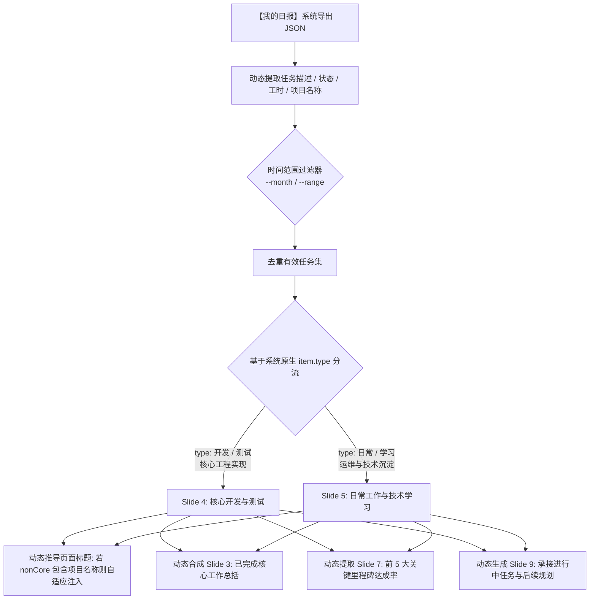

# 📊 MES 工程师月报 PPT 自动化生成与排版规范 (mes-monthly-report)

本技能定义了**智能制造组 / MES 开发工程师月度工作汇报（PPTX）**的端到端标准化流水线。
涵盖从**系统工作记录 JSON 结构化解析**、**工程技术业绩提炼与多维度归类**、**企业级 PPT 模板 OpenXML 无损解包与精准注入**、**SmartArt 图示与状态高亮适配**，到**无头 PowerPoint 图像导出与视觉质检闭环**的全流程标准。

---

## 1. 🎯 汇报定位与核心价值

企业月报是展示软件工程成果、对齐技术方向与向上汇报的关键媒介。传统手工排版耗时且容易出现格式错乱、溢出、字号不一等问题。
本技能实现以下核心目标：
1. **自动化摄入**：直读 MES 系统工作流或 OA 导出的每日工时、任务描述与学习记录 JSON。
2. **专业化提炼**：将零散的流水账日报自动升华提炼为严谨、量化的工业制造软件工程业绩（避免口语化表达）。
3. **像素级无损注入**：基于公司标准模板（如浦林成山企业绿与状态红配色）解包 OpenXML，保持母版、页眉、页脚、Logo、图形阴影 100% 原汁原味。
4. **排版防溢出自适应**：智能计算条目数量、字符长度，自适应调节行高与字号，杜绝换行截断和卡片溢出。
5. **视觉校验闭环**：通过脚本调用 PowerPoint COM 组件自动渲染导出幻灯片高保真 JPG 图片，供 Agent 和工程师进行视觉复核。

---

## 2. 📥 输入数据源与获取指引 (Data Source & Ingestion)

> [!TIP]
> **💡 数据源获取指引（重要）**：  
> 本月报自动化工具所需的工作记录 JSON 数据来源于公司内部 **「日报系统」->「我的日报」**。
> 
> **获取方式步骤**：
> 1. 打开浏览器登录公司内部 **日报系统**；
> 2. 点击左侧/顶部导航栏进入 **「我的日报」** 页面；
> 3. 在页面上方筛选目标月份或统计时间区间并点击查询；
> 4. 按 `F12` 打开浏览器开发者工具（Network/网络面板），点击查询请求复制接口返回的完整 JSON 响应体（或直接点击导出为 `.json` 文件）；
> 5. 将该 JSON 内容直接提供给 Agent 或通过 `--input` 参数传入生成脚本。

系统导出的标准工作记录 JSON 结构如下：

```json
{
  "total": 0,
  "rows": [
    {
      "id": 18809,
      "name": "裴子含",
      "date": "20260902",
      "group": "智能制造组",
      "jobNumber": "19260984",
      "list": [
        {
          "content": "补充完善相关skill，增加db映射相关规则和查询脚本，更新readme介绍文件。",
          "type": "开发",
          "time": "3",
          "progress": "100",
          "nonCore": "{\"项目名称\":\"MES系统开发\",\"任务描述\":\"补充完善相关skill，增加db映射相关规则和查询脚本...\"}"
        },
        {
          "content": "学习自学习agent hermes相关内容和对应api。",
          "type": "学习",
          "time": "2",
          "progress": "100",
          "nonCore": "{\"学习目标\":\"学习自学习agent hermes相关内容和对应api。\"}"
        }
      ]
    }
  ]
}
```

### 关键字段说明
- `rows[].name`：汇报人姓名（自动映射至 Slide 1 封面）。
- `rows[].group`：所属业务组（如“智能制造组”，映射至 Slide 1 封面）。
- `rows[].date`：工作日期（`YYYYMMDD` 格式，如 `20260902`，用于精准判定与时间范围筛选）。
- `list[].type`：工作属性（`开发` / `日常` / `学习` / `测试`）。
- `list[].content` 与 `nonCore`：工作原始描述、任务目标、接口与项目背景，是提炼核心成果的主要来源。

---

## 2.1 📅 时间范围区分与交互提示准则 (Date Range Protocol)

> [!IMPORTANT]
> **全量数据区分准则**：系统导出的 JSON 往往包含全部历史记录或跨越多个月份（例如一次性导出包含 `2026-08-26` 到 `2026-09-02`）。在生成月报时**严禁无差别混入跨月记录**，必须严格按目标时间范围进行数据清洗与过滤。

### 🤖 Agent 交互提示硬性规范
当用户触发月报制作需求时，Agent 必须遵循以下提示逻辑：

1. **若用户尚未提供 JSON 数据**：
   - 主动指引用户获取路径：
     > 「请登录公司 **【日报系统 -> 我的日报】**，选择目标统计月份或日期区间查询，并将接口返回的完整 JSON 响应（或导出的 `.json` 文件）发送给我，我将为您自动完成月报提炼与 PPT 制作。」
2. **若用户已提供全量 JSON 数据**：
   - 扫描 `rows[].date` 计算原始数据时间跨度（例如 `2026-08-26` ~ `2026-09-02`）；
   - 在回复中明确给出时间范围锁定提示，例如：
     > 「已成功获取您从【日报系统 -> 我的日报】导出的工作记录。当前原始数据时间跨度为 **2026-08-26 至 2026-09-02**（共 6 天记录，跨越 8月与 9月）。  
     > 本次月报已为您精准锁定 **【2026年08月度】（2026-08-01 至 2026-08-31）** 的工作成果进行汇报（共 4 天有效记录）；  
     > 9月份的新增工作已自动归入下月储备库。如您需要合并汇报，也可随时指定自定义时间范围。」
3. **支持多模式时间切分**：
   - **标准月度模式**：`--month 08` 或 `--month 202608`，仅提取目标自然月内的条目，封面标题为 `开发工程师月报-MM月`。
   - **自定义区间模式**：`--start-date 20260826 --end-date 20260902`，适用于双周报、阶段转正汇报或跨月专项技术攻关总结。

---

## 3. 🧠 纯动态数据解析与字段驱动分类引擎 (Field-Driven Dynamic Engine)

> [!IMPORTANT]
> **绝无硬编码关键词**：系统绝不硬编码任何具体的人名（如“顾工”、“王处长”）、业务功能（如“半成品”、“物料”）或技术框架名称。
> 分类与提取**完全基于【我的日报】系统原生数据字段结构（`item.type`、`item.progress`、`item.time` 与 `nonCore.项目名称`）**，确保任意开发人员、任意月份、任意项目的 JSON 都能纯通用解析。

### 3.1 动态字段解析与无关键词清洗规则
对每一条日常工作记录（`rows[].list[]`）：
1. **任务描述提取**：优先解析 `nonCore` 中的 `任务描述` 或 `学习目标`；若无则提取 `item.content`。
2. **通用文本清洗**：剔除代码仓库 URL（`https://...`），多余换行统一转为中文逗号，清理首尾多余标点。
3. **状态动态判定（零关键词）**：
   - 完全基于系统原生字段 `item.progress` 数值：
     - 若 `parseInt(item.progress) >= 100`，自动标记为企业红字 **`完成`**；
     - 若 `progress < 100`，自动标记为企业红字 **`进行中`**。
4. **工作量权重排序**：按每项任务实际填报工时 `item.time` 降序排列，优先展示核心重点工作。

### 3.2 基于系统类型的双轨分流引擎



### 3.3 幻灯片内容动态生成与上限截取
- **Slide 4（核心开发与测试）**：动态聚合 `type === '开发'` 与 `type === '测试'` 的条目，按耗时排序截取前 7 条，单条字号 11.5pt，自适应行间距 1.25x。页面标题自适应命名为 `月度总结丨[项目名称]` 或 `月度总结丨核心开发与测试`。
- **Slide 5（日常工作与技术学习）**：动态聚合 `type === '日常'` 与 `type === '学习'` 的条目，截取前 9 条，单条字号 11pt，自适应行间距 1.15x。页面标题自适应命名为 `月度总结丨日常运维与技术学习`。
- **自适应分页容错**：若某工程师当月全为“开发”类记录或全为“日常”类记录，系统自动按工时先后分屏排布至 Slide 4（前半部分）与 Slide 5（后半部分），绝不留空。
- **Slide 3（日常工作总览）**：动态提取 Slide 4 与 Slide 5 的前 3 项核心成果，自动合成：`已完成：[任务A]、[任务B]、[任务C]。未完成：无`。
- **Slide 7（上月计划达成率）**：动态从 `status === '完成'` 的条目中提取最具代表性的 4~5 项，自动装配 Wingdings 绿色圆点（`l`）与打勾（`ü`）。
- **Slide 9（工作计划）**：自动提取处于 `进行中` 的攻关任务，结合当前参与项目自适应生成 4 项行动项（亦可通过 `--plans "项1;项2;项3"` 自定义覆盖）。

---

## 4. 📐 PPT 模板架构与页面动静分离原则 (Architecture & Page Classification)

标准企业月报 PPTX（10 页架构）遵循严格的**“8 页固定骨架 + 2 页纯动态工作明细”**设计原则：

> [!IMPORTANT]
> **动静分离原则**：
> 1. **8 个固定骨架页**（封面、目录、日常工作总览、过渡页1、上月计划达成率、过渡页2、工作计划、结束页）：版式结构与页面主标题均保持固定，仅注入对应元数据或汇总条目；
> 2. **2 个纯动态明细页（Slide 4 与 Slide 5）**：**绝不能预设任何固定的标题或内容**！标题（`月度总结丨[业务主题/项目名]`）与条目列表 100% 由输入的【我的日报】JSON 动态分析生成或由用户自定义覆盖。

### 幻灯片与 XML 文件映射表

| 幻灯片类别 | 幻灯片编号 | 页面名称 / 视觉组件 | 核心 XML 路径 | 动静态规则与关键注入点 |
| :--- | :--- | :--- | :--- | :--- |
| **固定骨架** | **Slide 1** | **封面页** (Cover) | `ppt/slides/slide1.xml` | **固定标题格式**（`开发工程师月报-MM月`），动态替换姓名与部门 |
| **固定骨架** | **Slide 2** | **目录页** (TOC) | `ppt/slides/slide2.xml` | **完全固定**（保持原厂 01/02/03 目录与编制指引） |
| **固定骨架** | **Slide 3** | **月度总结丨日常工作总览** | `ppt/diagrams/drawing1.xml`<br>`ppt/diagrams/data1.xml` | **固定主标题**，SmartArt 自动汇总提取当月核心已完成亮点 |
| **纯动态** | **Slide 4** | **动态工作明细页 1** | `ppt/slides/slide4.xml` | **标题与内容纯动态**！根据 JSON 提取第一重点项目/业务，标题自适应（如 `月度总结丨[项目名]`），注入工作项与红字状态 |
| **纯动态** | **Slide 5** | **动态工作明细页 2** | `ppt/slides/slide5.xml` | **标题与内容纯动态**！根据 JSON 提取第二重点项目/日常学习/续页，标题自适应扩展，注入工作项与红字状态 |
| **固定骨架** | **Slide 6** | **过渡页 1** (Transition) | `ppt/slides/slide6.xml` | **完全固定**（章节切换：`02 上月计划达成率`） |
| **固定骨架** | **Slide 7** | **上月计划达成率** (Rate) | `ppt/slides/slide7.xml` | **固定主标题**，动态从已完成任务中提取 4~5 项重点成果（绿色 Wingdings 标记） |
| **固定骨架** | **Slide 8** | **过渡页 2** (Transition) | `ppt/slides/slide8.xml` | **完全固定**（章节切换：`03 工作计划`） |
| **固定骨架** | **Slide 9** | **工作计划** (Plan) | `ppt/slides/slide9.xml`<br>`ppt/diagrams/drawing2.xml` | **固定主标题**（`工作计划`），SmartArt 卡片动态提取在研延续任务与后续规划 |
| **固定骨架** | **Slide 10**| **结束页** (Thanks) | `ppt/slides/slide10.xml` | **完全固定**（`谢谢观看 / THANKS FOR WATCHING`） |

---

## 5. 🎨 核心 XML 节点代码片段与排版规则

### 5.1 Slide 4 / 5：工作项列表与红色状态标记
列表位于 `name="Rectangle 6"` 形状内的 `<p:txBody>`。每项由文本和红字状态构成：

```xml
<a:p>
  <a:pPr lvl="1">
    <!-- 行间距控制：7项用 125000 (1.25x)；9~10项不加此行即为默认 1.0x -->
    <a:lnSpc><a:spcPct val="125000"/></a:lnSpc>
  </a:pPr>
  <a:r>
    <a:rPr lang="zh-CN" altLang="en-US" sz="1150" dirty="0">
      <a:solidFill><a:prstClr val="black"/></a:solidFill>
      <a:latin typeface="微软雅黑"/><a:ea typeface="微软雅黑"/><a:cs typeface="Arial"/>
    </a:rPr>
    <a:t>与王处长沟通物料流转周期统计界面需求细节与技术实现方案（</a:t>
  </a:r>
  <a:r>
    <a:rPr lang="zh-CN" altLang="en-US" sz="1150" dirty="0">
      <!-- 浦林成山标准状态红 FF0000 -->
      <a:solidFill><a:srgbClr val="FF0000"/></a:solidFill>
      <a:latin typeface="微软雅黑"/><a:ea typeface="微软雅黑"/><a:cs typeface="Arial"/>
    </a:rPr>
    <a:t>完成</a:t>
  </a:r>
  <a:r>
    <a:rPr lang="zh-CN" altLang="en-US" sz="1150" dirty="0">
      <a:solidFill><a:prstClr val="black"/></a:solidFill>
      <a:latin typeface="微软雅黑"/><a:ea typeface="微软雅黑"/><a:cs typeface="Arial"/>
    </a:rPr>
    <a:t>）</a:t>
  </a:r>
  <a:endParaRPr lang="en-US" altLang="zh-CN" sz="1150" dirty="0">
    <a:solidFill><a:prstClr val="black"/></a:solidFill>
    <a:latin typeface="微软雅黑"/><a:ea typeface="微软雅黑"/><a:cs typeface="Arial"/>
  </a:endParaRPr>
</a:p>
```

### 5.2 Slide 7：计划达成率的 Wingdings 企业绿图标
每个任务由一个“任务段落”和一个“状态段落”成对出现：

```xml
<!-- 1. 任务段落：使用 Wingdings 'l' 字符表示企业绿实心圆点 -->
<a:p>
  <a:pPr lvl="1">
    <a:lnSpc><a:spcPct val="150000"/></a:lnSpc>
    <a:buClr><a:srgbClr val="005E3C"/></a:buClr>
    <a:buFont typeface="Wingdings"/><a:buChar char="l"/><a:defRPr/>
  </a:pPr>
  <a:r>
    <a:rPr lang="zh-CN" altLang="en-US" sz="1200" kern="1200" dirty="0">
      <a:solidFill><a:prstClr val="black"/></a:solidFill>
      <a:latin typeface="微软雅黑"/><a:ea typeface="微软雅黑"/><a:cs typeface="Arial"/>
    </a:rPr>
    <a:t>物料流转周期统计界面前端与后端开发、功能调整及测试代码提交。</a:t>
  </a:r>
  <a:endParaRPr .../>
</a:p>

<!-- 2. 状态段落：使用 Wingdings 'ü' 字符表示企业绿打勾 ✔ -->
<a:p>
  <a:pPr marL="190500" lvl="1" indent="-188913">
    <a:lnSpc><a:spcPct val="150000"/></a:lnSpc>
    <a:buClr><a:srgbClr val="005E3C"/></a:buClr>
    <a:buFont typeface="Wingdings"/><a:buChar char="ü"/><a:defRPr/>
  </a:pPr>
  <a:r>
    <a:rPr lang="zh-CN" altLang="en-US" sz="1200">
      <a:solidFill><a:prstClr val="black"/></a:solidFill>
      <a:latin typeface="微软雅黑"/><a:ea typeface="微软雅黑"/><a:cs typeface="Arial"/>
    </a:rPr>
    <a:t>状态：完成。</a:t>
  </a:r>
  <a:endParaRPr .../>
</a:p>
```

### 5.3 排版与防溢出黄金准则 (Anti-Overflow Rules)
- **Slide 4 (MES开发)**：容量为 6~7 个条目。推荐字号 `sz="1150"` (11.5pt)，行高 `val="125000"` (1.25x)。单条文本控制在 42 个中文字符以内（最多占 2 行），确保最后一条底部距离外框线预留至少 15px 空白。
- **Slide 5 (PDA/AI/数采)**：容量为 8~10 个条目。推荐字号 `sz="1100"` (11pt)，行高采用单倍行距（不设置 `a:lnSpc`）。标题框的 `<a:ext cx="3528392"/>` 必须扩展为 `<a:ext cx="6500000"/>`，否则标题文字会尴尬折成两行。
- **Slide 9 (工作计划 SmartArt)**：容量固定为 4 项。每项文字字号为 12pt，结尾加句号，卡片标题加粗 14pt。

---

## 6. 🛠️ 配套自动化工具链 (Scripts)

在 `mes-monthly-report/scripts/` 目录下提供完整自动化生成与验证脚本：

### 6.1 月报一键生成器 (`scripts/generate_monthly_report.js`)
接收原始数据 JSON 与 PPTX 模板，支持多种时间范围过滤模式，一键完成解包、XML 注入与封包：

```bash
# 模式 1：严格按自然月筛选生成（自动过滤跨月记录，推荐）
node mes-monthly-report/scripts/generate_monthly_report.js \
  --template "C:\Users\zhpei\Downloads\Monthly_Report_202608_cyjiang.pptx" \
  --input "mes-monthly-report/examples/sample_work_record.json" \
  --output "d:\zhpei\Desktop\Monthly_Report_202608_zhpei.pptx" \
  --name "裴子含" \
  --group "智能制造组" \
  --month "08"

# 模式 2：指定自定义日期区间（如双周报或阶段转正汇报）
node mes-monthly-report/scripts/generate_monthly_report.js \
  --input "work_record.json" \
  --start-date 20260826 \
  --end-date 20260902 \
  --output "d:\zhpei\Desktop\Report_Phase1.pptx"
```

### 6.2 PPT 幻灯片无头导出与质检 (`scripts/export_ppt_slides.ps1`)
调用 Windows 本地 PowerPoint COM 组件，导出全量幻灯片高保真 JPG，供多模态 Agent 视觉复核：

```powershell
powershell -ExecutionPolicy Bypass -File mes-monthly-report/scripts/export_ppt_slides.ps1 \
  -pptxPath "d:\zhpei\Desktop\Monthly_Report_202608_zhpei.pptx" \
  -outputDir "C:\Users\zhpei\AppData\Local\Temp\monthly_report_preview"
```

---

## 7. 🔍 质量验收核查清单 (Checklist)

每次生成月报 PPT 后，必须按以下清单进行逐项核验：
- [ ] **时间范围提示与确认**：已向用户清晰明确当前数据全量跨度及本次月报锁定的时间范围（如 2026.08.01 ~ 2026.08.31），无跨月杂质数据。
- [ ] **封面合规**：姓名、部门（智能制造组）、月份（如 08月）均已正确替换，无模板原作者残留。
- [ ] **Slide 4 / 5 标题**：无 `LIMS` 等旧项目残留，Slide 5 标题单行展示不折行。
- [ ] **状态红字**：所有 `（完成）` 或 `（进行中）` 均使用企业标准红字（`FF0000`）。
- [ ] **容器无溢出**：Slide 4 与 Slide 5 底部文本与绿色卡片下边框有充分间距，未发生文字截断或冲出底线。
- [ ] **达成率图标**：Slide 7 呈现规范的绿色小圆点与绿色打勾，状态全为 `状态：完成。`。
- [ ] **计划卡片**：Slide 9 卡片标题为 `MES与PDA项目`，4 项行动计划表述具有前瞻性与落地性。
- [ ] **文件保存**：输出文件必须保存于用户指定路径（如用户桌面或工作区），并提供系统可点击的 `file://` 链接。

