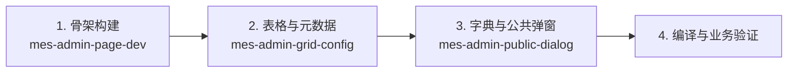
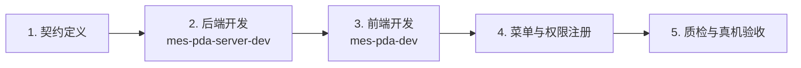

# MES 全景开发路由器与编排器 (mes-router)

本技能是 `D:\mes\mes-major` MES 全系统的**顶层路由器与任务编排中枢 (Orchestrator)**。
采用**渐进式分层加载（Progressive Disclosure）**设计，负责子系统定位、复合任务配方组合及多智能体（Subagent）并行协同调度。

---

## 1. 🏛️ 全景架构与路径速查矩阵 (L1 索引)

| 核心子系统 | 物理工程目录 (D:\mes\mes-major) | 技术栈与架构特征 | 挂载专属技能 |
| :--- | :--- | :--- | :--- |
| **📱 PDA 移动端前端** | `03-PDA\LonSon.Mobile.PrinxChengShan.App` | H5 / MUI / Vue 2 (`vue@2.js`) / 硬件扫码 | 🟢 `mes-pda-dev` |
| **📱 PDA 服务端后端** | `04-服务器端程序\LonSon.Mobile.PrinxChengShan.App.Web` | .NET Web / ASHX 接口 / BLL / DAL / Oracle / SQL Server | 🟢 `mes-pda-server-dev` |
| **🖥️ MES 管理端** | `05-MES管理端` (BUS / VIEW / PUBLIC / PLMES) | WinForms / DevExpress / C/S 独立桌面架构 | 🟢 `mes-admin-page-dev`<br>🟢 `mes-admin-grid-config`<br>🟢 `mes-admin-public-dialog` |
| **🏭 工控/上位机/采集** | `01-硫化上位机`、`02/15-LCC`、`11-POP`、`10-设备接口` | 独立 C# 工控程序 / 串口 / PLC / RFID / 采集 | ⚪ 工控子系统专项开发 |
| **🌐 后台通用服务** | `04-服务器端程序` (RestfulAPI, WebAPI, 调度服务) | Windows Service / WebAPI / 跨系统同步 | ⚪ 后台服务专项开发 |

---

## 2. 🧩 复合任务流水线配方 (Task Recipes)

面对复合型业务开发任务，主 Agent 应当按照以下标准化配方链序贯调用技能：

### 📋 配方 A：MES 管理端全流程页面开发
适用于在 `05-MES管理端` 中新建或重构完整业务模块（如 CKA、STC、STD）：



1. **Phase 1 (骨架)**：加载 `mes-admin-page-dev`，创建 BUS 业务类与 VIEW 窗体，搭建查询、按钮、增删改接口。
2. **Phase 2 (表格)**：加载 `mes-admin-grid-config`，配置 `LSDataGrid` 列绑定、`EditSerializable` 及 `.resx` 资源。
3. **Phase 3 (弹窗)**：若涉及公共选单，加载 `mes-admin-public-dialog` 查阅 `GetIDIALOG` Key 路由并绑定交互。
4. **Phase 4 (验证)**：执行编译检查，验证权限、数据绑定与事务回滚。

---

### 📱 配方 B：PDA 端到端全栈功能开发
适用于新增或改造 PDA 扫码作业功能（如入库、移库、盘点、质检、报工）：



1. **Phase 1 (契约制定)**：明确入参（`BARCODE`, `FAC`, `LOGINNAM`, `Token` 等）、Action 动作名及返回的 `TL` 数据集结构。
2. **Phase 2 (服务端开发)**：加载 `mes-pda-server-dev`，在 `04-服务器端程序\LonSon.Mobile.PrinxChengShan.App.Web` 中创建 `Web/Ashx/Xxx.ashx`，在 BLL 编写 Action 路由分发与多语言解析，在 DAL 使用 `MsSqlHelper` / `OracleHelper` 编写带 `/*PDASQL*/` 标记的 SQL 与事务。
3. **Phase 3 (前端开发)**：加载 `mes-pda-dev`，在 `03-PDA` 对应业务目录构建 HTML/MUI 页面与 Vue2 实例，适配扫码 5 大硬件规范（`keyCode === 0 || 13`、`v-model.trim`、全局 Focus Lock、`CheckBarcodeLengthClick`）。
4. **Phase 4 (菜单权限)**：在权限系统配置 `NodeURL` 路径，验证 `SwitchFTY.html` 多工厂切换数据隔离。
5. **Phase 5 (联调质检)**：执行 PDA 静态质检脚本，验证连续扫码与网络超时等容错边界。

---

### 🔍 配方 C：公共字典与选择框扩展
适用于管理端新增或调整公共基础选择窗体：

1. **Phase 1 (检索与注册)**：加载 `mes-admin-public-dialog`，运行 `scripts/extract_idialog_routes.py` 检索现有 Key 分布，在 `SysPublic` 中注册新 Key 与 View/Bus 映射。
2. **Phase 2 (调用绑定)**：在调用方页面使用 `ShowDialog(Key)` 传参，完成多选/单选回传数据赋值。

---

## 3. 🤖 Subagent 多智能体分工协同规范

当任务规模较大、涉及**跨前后端联调**或**批量页面改造**时，主 Agent 应使用 `invoke_subagent` 派发专业子智能体并行作业：

### 🎯 推荐子智能体角色分工

| 子智能体角色 (Role) | 挂载技能 (Skills) | 职责边界 |
| :--- | :--- | :--- |
| **`PDA-Frontend-Developer`** | `mes-pda-dev` | 仅负责 `03-PDA` 下的 H5、MUI 布局、Vue 状态管理与硬件扫码适配。 |
| **`PDA-Backend-Developer`** | `mes-pda-server-dev` | 仅负责 `04-服务器端程序` 下的 ASHX 接口、BLL 业务逻辑与 DAL 数据访问。 |
| **`Admin-Form-Developer`** | `mes-admin-page-dev`<br>`mes-admin-grid-config` | 负责 `05-MES管理端` 的 WinForms 窗体、BUS 业务层与表格元数据配置。 |
| **`Dialog-Route-Auditor`** | `mes-admin-public-dialog` | 负责检索公共对话框路由表，提取构造函数契约，提供精确的调用代码片段。 |

### 🔄 多智能体协作流水线范式
```text
主 Agent (调度与契约制定)
   │
   ├─► 1. 确定前后端 JSON / 接口契约
   │
   ├─► 2. 并行派发 Subagent:
   │      ├─► [PDA-Frontend-Developer] 编写前端 UI 与扫码交互
   │      └─► [PDA-Backend-Developer] 编写后端 ASHX 与 SQL
   │
   └─► 3. 汇总子智能体交付物，执行联调验证
```

---

## 4. ⚡ 渐进式分层加载协议 (Progressive Disclosure)

为了最小化 Context Token 消耗并提升响应速度，严格遵循三层加载原则：

```text
┌────────────────────────────────────────────────────────┐
│  Level 1: 根路由 (mes-router)                          │
│  - 仅包含目录矩阵、配方组合与 Subagent 调度规则        │
└───────────────────────────┬────────────────────────────┘
                            │ 按需精确下钻
┌───────────────────────────▼────────────────────────────┐
│  Level 2: 领域专属技能 (mes-admin-* / mes-pda-dev)     │
│  - 仅在进入具体子任务时加载，包含代码模板、规范与避坑  │
└───────────────────────────┬────────────────────────────┘
                            │ 按需执行
┌───────────────────────────▼────────────────────────────┐
│  Level 3: 可执行脚本与字典 (scripts/*)                 │
│  - extract_idialog_routes.py 等自动化工具按需运行      │
└────────────────────────────────────────────────────────┘
```

> 📌 **快速直达规则**：若任务意图已非常明确（如“修改 PDA 扫码逻辑”或“配置 CKA 表格列”），Agent **无需先读 mes-router**，可直接激活目标 L2 技能（如 `mes-pda-dev` 或 `mes-admin-grid-config`），节省推理轮次与上下文。
